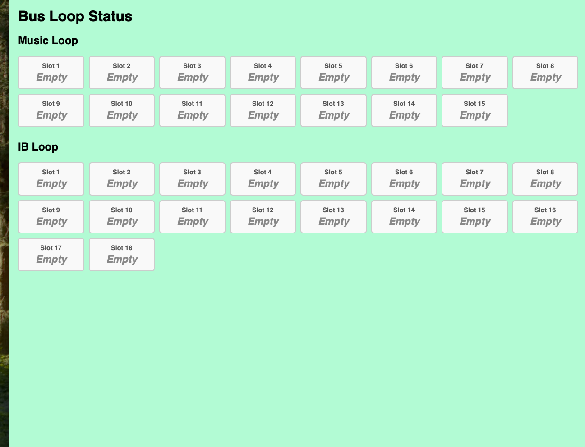
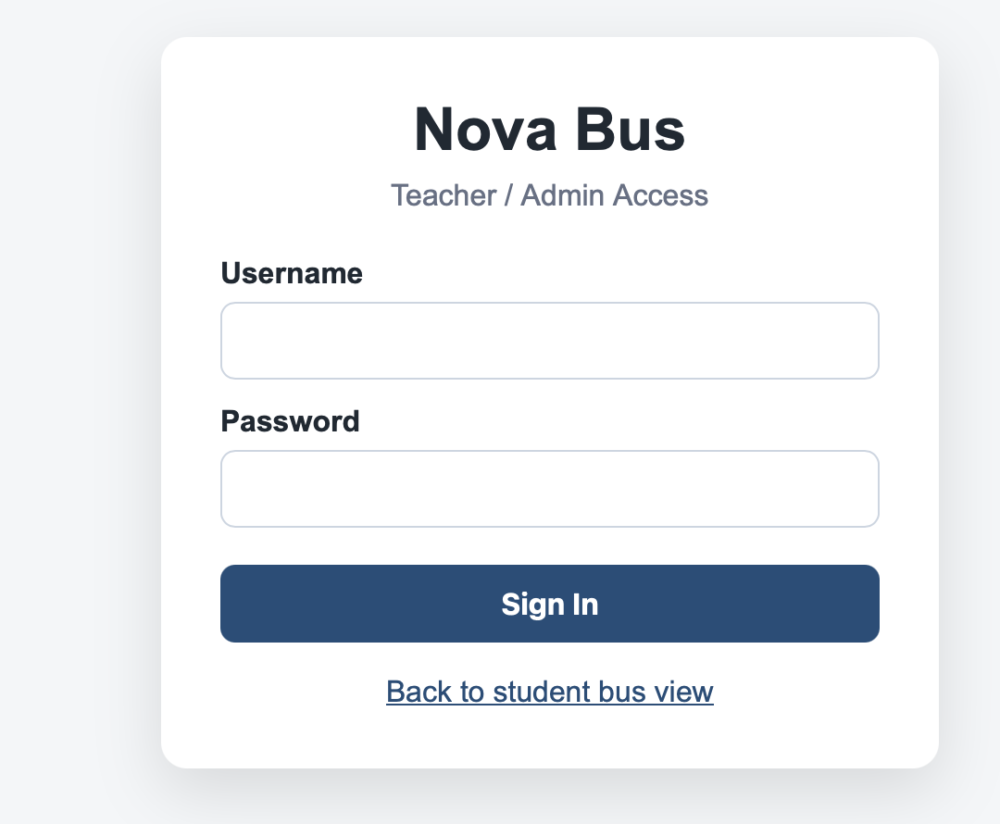

# Nova-Bus-App-project

To setup, setup a python venv(virual environment) w/ python3 -m venv venv
run: pip install -r requirements.txt

to launch server(on your computer) run: python manage.py runserver

to populate data(rows in db for testing) run:

```python
from loops.models import BusSlot, LoopType

# Create 15 slots for the Music Loop
for i in range(1, 16):
    BusSlot.objects.get_or_create(loop=LoopType.MUSIC, slot_number=i)

# Create 18 slots for the IB Loop
for i in range(1, 19):
    BusSlot.objects.get_or_create(loop=LoopType.IB, slot_number=i)

print(f"Total slots in database: {BusSlot.objects.count()}")
```


# Updates


## Loops:
up to:


